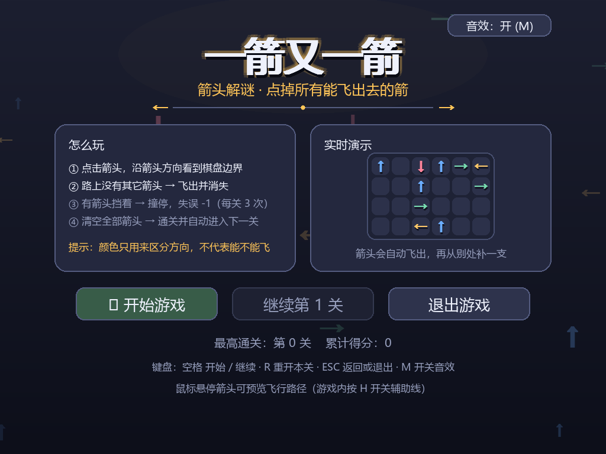
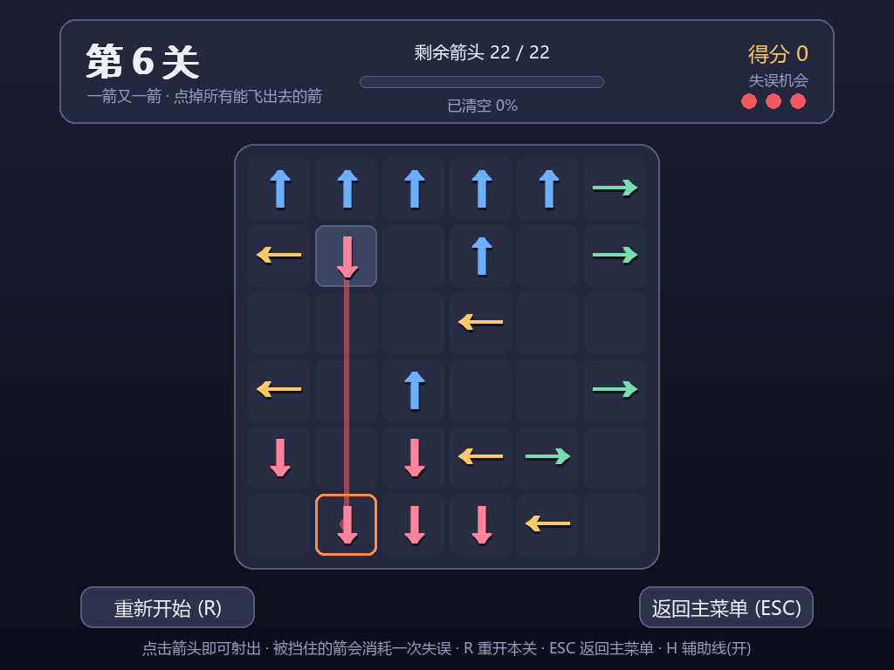
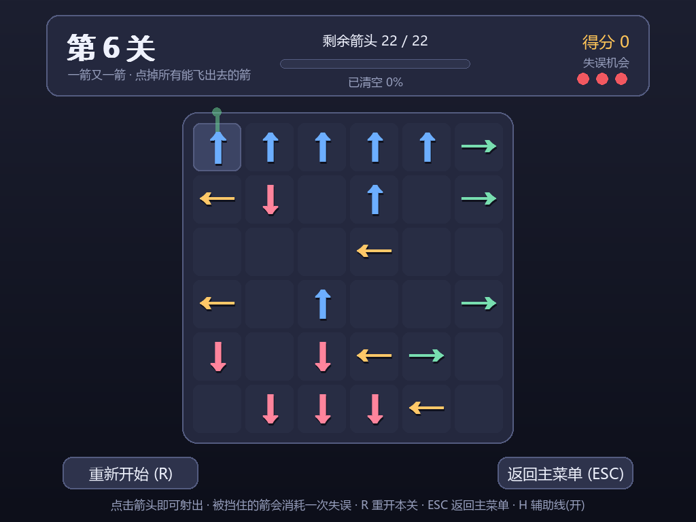
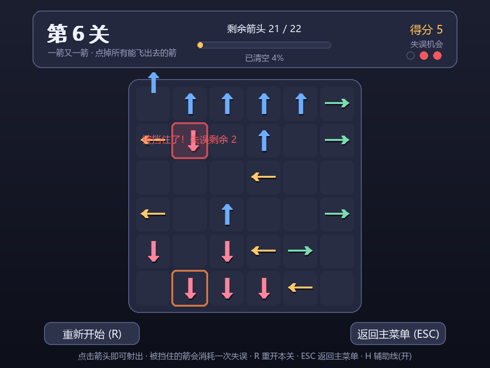
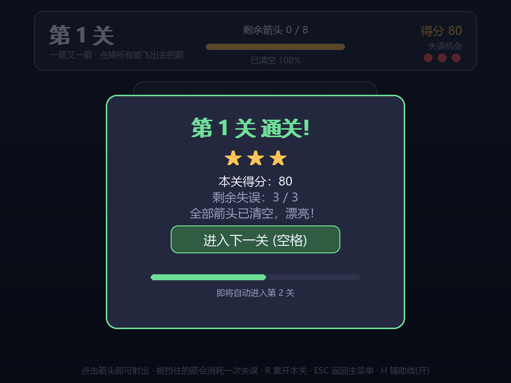
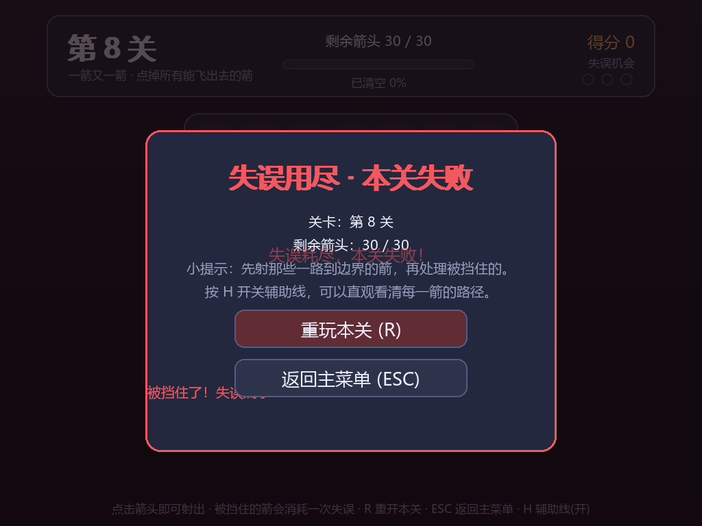

# 一箭又一箭 · 箭头解谜小游戏

用 Python + Pygame 实现的箭头解谜小游戏：棋盘上摆满四个方向的箭头，点击后箭头会沿自己的方向
检查到棋盘边界的整条路径，畅通就飞出去，被别的箭头挡住就撞停并消耗一次失误。
清空全部箭头即通关，失误耗尽则本关失败。

玩法参考微信小游戏《一箭又一箭》的核心思路，但其代码、素材、关卡均为本项目自行实现，
全部界面元素由 pygame 图元与字体字符绘制，音效由代码实时合成，不含任何外部素材文件。

## 开发环境

| 项目 | 版本 / 说明 |
| --- | --- |
| 操作系统 | Windows 11 |
| Python | 3.10.11 |
| pygame | 2.6.1（SDL 2.28.4） |
| 中文字体 | 自动查找系统字体（微软雅黑 msyh.ttc，缺失时依次尝试黑体 / 宋体 / 思源黑体等） |
| 开发工具 | Codex（GPT-5）辅助编码，人工设计规则、试玩关卡并逐轮验证 |

项目不依赖 numpy 等第三方库，除 pygame 外只用 Python 标准库。

## 运行方式

```bash
pip install pygame
python main.py
```

环境要求：Python 3.8+ 与 pygame 2.0+（开发与自检环境为 Python 3.10.11 + pygame 2.6.1）。
首次运行会自动使用系统中的中文字体（微软雅黑 / 黑体等），无需安装任何字体或图片素材。

## 玩法规则

1. 棋盘是二维网格，每格取值 `0=空`，`1=向上↑`，`2=向下↓`，`3=向左←`，`4=向右→`。
2. 点击箭头后，沿箭头方向检查它到棋盘边界之间的格子：

   - 中间没有其它箭头 → 箭头飞出并消失（获得 10 分）；
   - 中间有其它箭头 → 撞停，出现碰撞反馈（抖动 + 红框 + 标出阻挡者），消耗 1 次失误并扣 5 分。

3. 每关初始 3 次失误，点错一次扣 1 次；归零后等到晃动动画播完，自动切换到失败界面。
4. 清空全部箭头 → 本关通关，展示战绩面板，2 秒后自动进入下一关。
5. 四种操作界面：开始界面、游戏界面、通关界面、失败界面。
6. 音效由代码实时合成（射出、撞停、通关、失败、按钮、悬停、进关各一种），
   开始界面右上角的胶囊按钮或游戏内按 `M` 可以随时开关，不需要任何音频文件。

## 操作说明

| 操作 | 作用 |
| --- | --- |
| 鼠标左键点击箭头 | 射出箭头 / 触发碰撞反馈 |
| 鼠标悬停箭头 | 显示该箭头的飞行路径（绿色畅通、红色被挡） |
| `R` | 重新开始当前关卡（还原出题时的初始局面） |
| `空格` / `回车` | 开始游戏；在通关 / 失败界面继续或重玩 |
| `ESC` | 返回主菜单；在开始界面则退出游戏 |
| `H` | 开关悬停辅助线 |
| `M` | 开关音效 |

界面底部与按钮上都会显示对应快捷键。

## 游戏截图

开始界面（发光标题 + 背景飘动箭头 + 实时演示小棋盘 + 音效开关）：



游戏界面：悬停被阻挡的箭头时，用红色路径指出它被谁挡住（绿色表示可以飞出）：





碰撞反馈与飞出动画同时发生（被点箭头左右晃动 + 红框，阻挡者描橙色框，箭飞出并淡出）：



失误归零瞬间的提示：


通关界面（星级评价 + 自动进入下一关倒计时）与失败界面：





## 目录结构

```
arrow_puzzle/
├── main.py               程序入口（python main.py）
├── requirements.txt      pygame 依赖
├── .gitignore            Git 忽略规则（缓存、虚拟环境、本地截图等）
├── README.md             本说明
├── screenshots/          四个界面的实际运行截图（由 tests/make_shots.py 生成）
├── docs/                 实验报告（AIGC 使用记录、测试结果、PSP 表）
├── tests/                自动化自检脚本
│   ├── run_all.py        一键运行全部自检
│   ├── check_logic.py    规则 / 关卡可解性 / 失误与动画 / 边界情况
│   ├── check_layout.py   界面排版不压字、字形不缺字
│   ├── check_render.py   像素级验证箭头、特效、开始界面与音效
│   ├── make_shots.py     重新生成 screenshots/ 里的截图
│   └── smoke_window.py   真实窗口 + 真实音频设备的冒烟测试
└── game/
    ├── __init__.py       包说明与模块分工
    ├── config.py         全局常量：窗口、配色、方向取值、难度曲线、节奏参数
    ├── board.py          棋盘模型：格子读写、路径判定、点击结果（纯逻辑，不依赖 pygame）
    ├── levels.py         关卡生成（逆向构造法）与可解性校验
    ├── animation.py      基于帧计数的晃动动画：被撞箭头的左右晃动（含失误归零判定）
    ├── effects.py        特效：箭头飞出、碰撞闪光、浮动提示文字
    ├── audio.py          音效：用代码合成 7 种波形（无音频文件）
    ├── menu_scene.py     开始界面的动态画面：背景飘动箭头 + 实时演示小棋盘
    ├── ui.py             界面控件：圆角按钮
    ├── renderer.py       字体加载、棋盘布局、四个界面的绘制
    └── app.py            状态机与主循环
```

## 自检与测试

作业里要求的功能点都有对应的自动化断言，在项目根目录执行：

```bash
python tests/run_all.py
```

它会依次运行三套脚本，共 280 项断言（`check_logic` 81 项、`check_layout` 154 项、`check_render` 45 项）：

| 脚本 | 覆盖内容 |
| --- | --- |
| `check_logic.py` | 四个方向的阻挡判定、越界与非法的边界情况、关卡必定可解、连续通关、失误归零流程、晃动动画帧数、无 `time.sleep` |
| `check_layout.py` | 四个界面的元素不越界不压字、文案不溢出卡片、548 个中文字与符号在该字体下都有字形 |
| `check_render.py` | 四种箭头绘制、悬停辅助线颜色、碰撞红框、飞出淡出、晃动像素位移、开始界面画面、音效合成与静音、主循环无异常 |

`tests/smoke_window.py` 会用**真实**窗口与音频设备各跑约 1.5 秒，用来确认实际机器上不掉帧、音效就绪。

## 实现要点

**一条规则只写一遍。** `board.check_block(grid, row, col, direction, rows, cols)` 是"这个箭头是否被
阻挡"的唯一入口：从当前格的下一格开始沿方向遍历到边界，遇到非 0 就返回 `True`，走到边界全空返回
`False`。四个方向分别实现，起点越界、空格、未知方向都安全返回 `False`，`rows/cols` 传大也会按实际
数组尺寸收敛，不会数组越界。游戏的 `Board.can_fly()`、`Board.blocker_of()`、关卡生成的
`path_is_clear()` 全部基于它，规则不会出现两处实现不一致的情况。

**关卡一定可解。** 关卡用"逆向构造法"生成：先把棋盘当成空的（相当于所有箭都已射出），再按
被射掉的顺序倒着放回箭头；每次放回时要求它前方到边界之间全为空，这正好等价于正着玩时它能飞出。
因此把放回顺序倒过来点击，必然可以清空棋盘。`levels.is_solvable()` 还会用贪心模拟再校验一遍
（"当前能飞的箭，以后一定能飞"，所以贪心不会漏解）。

**箭头用字符绘制。** 箭头由字体里的 `↑ ↓ ← →` 字符渲染，并带一层淡投影；如果系统字体缺少这些
字符，会自动退回用多边形绘制（`renderer.arrow_polygon_surface`）。全程不使用任何外部图片素材，
网格、按钮、进度条、失误圆点、星星评价都是 pygame 图元绘制。

**碰撞动画基于帧计数。** 点错箭头时用 `animation.ShakeAnimation` 记录两个状态变量——晃动的箭头
坐标 `cell` 与动画起始帧 `start_frame`，绘制时用 `(当前帧 - 起始帧)` 算出偏移量并叠加到箭头位置上，
只有横向分量所以表现为左右晃动，0.3 秒（60FPS 下 18 帧）后偏移自然归零。整个过程只用帧号推数据，
没有 `time.sleep`，不会阻塞主循环；同一时间可以有多支箭头在晃（`ShakeManager` 按格子坐标管理）。
失误次数由 `App.mistakes_left` 统一维护（每关初始值取自 `config.MISTAKES_PER_LEVEL`），扣到 0 后
标记 `fail_pending`，等晃动动画播完由 `update()` 自动切到失败界面。

**音效靠波形合成。** `audio.py` 用标准库 `array` 把"频率曲线 + 起音衰减包络"合成为 16bit 缓冲，
再交给 `pygame.mixer.Sound(buffer=...)`：射箭是 700→2200Hz 的短上滑加一点噪声，撞停是 200Hz 三角波
加噪声的闷响，通关是 C-E-G-C 上行琶音，失败是三个下行音。合成时会读取音频设备的实际采样率与声道数
（本机实测为 8 声道），所以音高和时长不会走样；若设备不可用则自动降级为无声，游戏照常运行。

**开始界面是活的。** `menu_scene.py` 提供两层动态：背景 16 支半透明箭头沿各自方向缓慢飘动、出画后
从对面绕回；右侧卡片里的 6×4 演示小棋盘每隔 0.6 秒自动挑一支"路径畅通"的箭射出（复用同一套飞出
动画），再从别处补一支新箭，让玩家在开始前就能看懂玩法。标题带暖色柔光与外发光描边，配合卡片式
排版与底部统计信息。

**排版有自检。** 各绘制函数除画面外还会返回一张"元素矩形表"，配套脚本据此检查是否有压字、
越界；另有一组像素级检查确认箭头、辅助线、碰撞框、飞出淡出确实画到了画面上。

## 常用调参位置

都在 `game/config.py` 与 `game/levels.py` 中：

| 想改什么 | 改哪里 |
| --- | --- |
| 窗口尺寸、帧率 | `config.py` 的 `WINDOW_WIDTH/HEIGHT`、`FPS` |
| 配色、四种箭头的颜色 | `config.py` 的 `COLOR_*`、`ARROW_COLORS` |
| 射出 / 失误的分数 | `config.py` 的 `SCORE_PER_ARROW`、`SCORE_PER_MISTAKE` |
| 每关初始失误次数 | `config.py` 的 `MISTAKES_PER_LEVEL`（默认 3） |
| 碰撞晃动时长 / 幅度 / 次数 | `config.py` 的 `SHAKE_DURATION`、`SHAKE_AMPLITUDE`、`SHAKE_CYCLES` |
| 飞出、自动进关的时长 | `config.py` 的 `FLY_DURATION`、`AUTO_NEXT_DELAY` |
| 音效开关、总音量、各音效音量 | `config.py` 的 `AUDIO_ENABLED`、`AUDIO_MASTER_VOLUME`、`AUDIO_VOLUMES` |
| 开始界面的飘动箭头与演示棋盘 | `config.py` 的 `MENU_PARTICLE_*`、`MENU_DEMO_*` |
| 棋盘大小、箭头密度、失误次数 | `levels.py` 的 `level_config()` |
